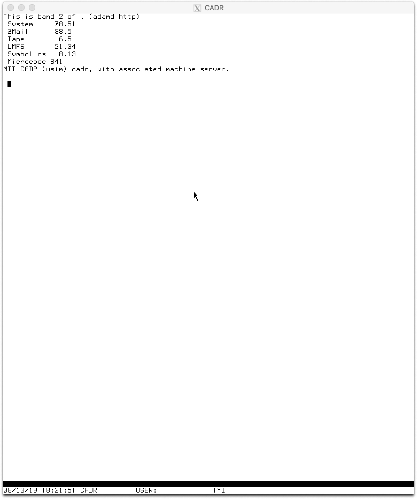
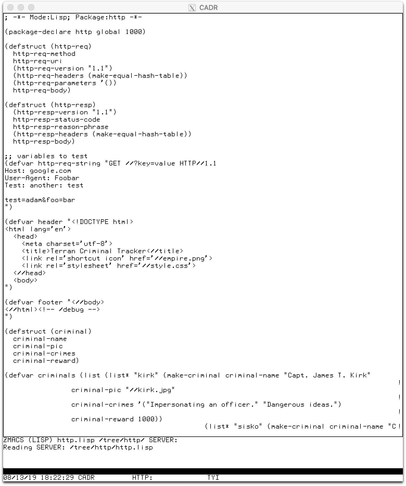

# dc2019f-mirror-universe


## Challenge Overview

The challenge is a web server running on a Lisp machine, specifically the CADR. 



The vulnerability is a Use-After-Free (UAF) on the Lisp machine that
occurs when you return a `&rest` parameter from a function. This
points onto the stack, and can be confused with another list (and only
another list due to data tagging of pointers in the CADR).

By triggering this vulnerability, they can execute `eval`
functionality, which is only for admins.

## Game Test

Here's the text that was given to the teams:

```
	A wormhole has appeared, what possible wonders does it contain?
	Our probes indicate that travel through the wormhole is slow and
	dangerous. Who will you find on the other side of the wormhole?
	Perhaps the greatest adversary of them all---yourself!

	Admin note: We've encountered probe loss leading to connection
	loss. Exposure to the wormhole will be limited to 12 seconds,
	possibly less. Go easy on this service, or you risk your game
	connection.

	Patches available at /beam_me_out

	Patched binary must be the same size as original.

	Sunday update: due to congestion at the worm_hole, each team will
	be restricted to four simultaneous connections into the
	mirror_universe. You will get a RST when you hit this limit, and
	it could decrease depending on load.

	https://oooverflow-challs.s3.amazonaws.com/17ee4c84b89b492011c91fea58fa24af473397a99c3c541ce223200876b2df27.tar.gz

	File to patch: system-78-48.LOD

	Max Patchable Bytes: 2147483647
```

## Local Environment

A [simple tmux script](./local_dev.sh) will run the `chaosd` service, `usim` (CADR emulator), and `worm_hole`:

```
./local_dev.sh
```

## Components

There are three main components to this challenge:

- The `chaosd` server that runs the chaosnet, and allows the CADR to login and access files.
- The `usim` CADR emulator
- The `worm-hole`, which translates HTTP to chaosnet.

### chaosd

Taken from https://github.com/LM-3/chaos , made minor changes to get
the worm-hole to work. Also made changes so that the CADR user does
not need a password to login (so that the CADR machine can auto-login
as the CADR user).

See [service/src/chaos](./service/src/chaos) for details.

### usim

The CADR emulator taken from https://github.com/LM-3/usim. Minor change to x11.c to get the CTRL key to work.

See [service/src/usim](./service/src/usim) for details.

### httpd server

HTTP server written in zetalisp. Used the
[chinual 4th edition](https://lm-3.github.io/chinual4th.html) to
program the server.

See [service/src/httpd/http.lisp](./service/src/httpd/http.lisp) for details.

Here's what the code looks like in the CADR:


### worm-hole

Frontend for the challenge, translates HTTP requests to the backend
usim, which speaks [chaosnet](https://en.wikipedia.org/wiki/Chaosnet).

https://lm-3.github.io/amber.html was a great resource.

All existing chaosnet libraries were garbage, so I wrote my own. [chaoslib.py](./service/src/worm_hole/chaoslib.py) will talk to a chaosnet service.

[worm_hole.py](./service/src/worm_hole/worm_hole.py) is the frontend
that checks the size of the request, handles the static files, visible
patches, then sends all other requests to usim.

## SLA Checks

A key challenge is how to prevent chump patches (there are no chumps
in the mirror universe) that simply remove the admin functionality.

To do this, I use the fact that the CADR lisp machine will load
`/home/cadr/lispm.init` on login, and from there we hook functions and
check that the eval still works.

[check_get_user.sh](./local-tester/check_get_users.sh) checks that we
can access admin functionality if `test-get-users` returns "burnham",
and
[check_admin_accessible.sh](./local-tester/check_admin_accessible.sh)
checks that we can access admin functionality if`test-admin` returns
`t`.

Note that each of these ensure that we are still logged in as the
`CADR` user, otherwise attacks wouldn't be able to read the flag. 

[check.py](./remote-interaction/check.py) check that the service is
functional from a remote perspective.

## Exploit

[exploit.sh](./remote-interaction/exploit.sh) has the exploit, it's
pretty simple.
